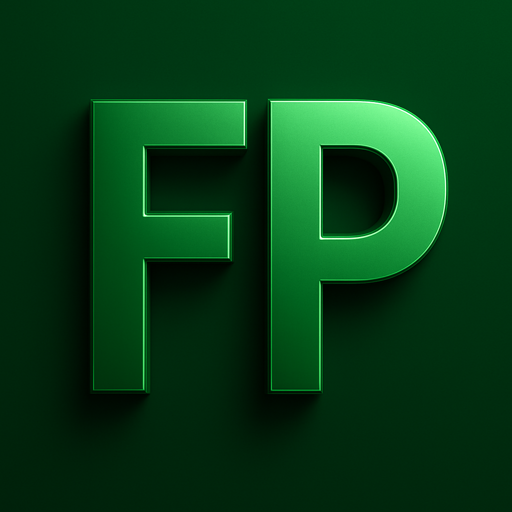

  

<h1 align="center">felipeparaizo.com.br</h1>

  <strong>Implementação do https://www.tabnews.com.br para o https://curso.dev</strong> 
  <em>Projeto desenvolvido para adquirir conhecimentos e habilidades em programação!</em>

  <a href="/README.md" target="_blank">🇺🇸 English</a>
  &nbsp;&nbsp;&nbsp;|&nbsp;&nbsp;&nbsp;
  <a href="https://github.com/Fparaiz0/felipeparaizo.com.br/issues" target="_blank">🐛 Reportar Bug</a>
  &nbsp;&nbsp;&nbsp;|&nbsp;&nbsp;&nbsp;
  <a href="https://github.com/Fparaiz0" target="_blank">💼 Perfil GitHub</a>

**felipeparaizo.com.br** é uma plataforma que replica a experiência do TabNews, permitindo que desenvolvedores criem e compartilhem conteúdos, ideias e discussões de forma simples, moderna e totalmente personalizável.

## 🛠️ Tecnologias Utilizadas

---

  Feito por <a href="https://github.com/Fparaiz0/" target="_blank">Felipe Paraizo</a>

